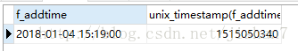
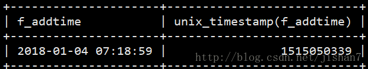

# 使用timestamp记录跨时区对战时间信息

## 需求场景

欧洲的玩家与中国的玩家匹配上了一场对局，而负责提供对战支持的服务器在美国

问题来了，这场对局的发生时间以哪个为准？

能不能满足一种需求，中国玩家查看对局信息时，对局开始时间是按北京时间日期算；而欧洲玩家查看对局信息时，又是按他当地的时间日期算。

## 制定方案

其实很简单，数据库里使用timestamp类型的字段，比如addtime来记录对局开始时间。

写入的时候不复杂，使用mysql 自带的now()函数 或者 CURRENT_TIMESTAMP，把美国的服务器时间写进表。

这时表里面实际储存的是一串数字，即时间戳，例如1515049982

读取的时候，可以用unix_timestamp(addtime)来把这个数字拿出来，然后再使用各个语言自带的时间函数，把它转为当地时间显示即可。

## 验证过程

找了国内和国外两个服务器，确认了当地服务器时间不同后，建同样的表。这个表addtime默认值是CURRENT_TIMESTAMP

```sql
CREATE TABLE `timetest` (
  `id` bigint(20) unsigned NOT NULL AUTO_INCREMENT,
  `addtime` timestamp DEFAULT CURRENT_TIMESTAMP COMMENT '添加时间',
  PRIMARY KEY (`id`)
) AUTO_INCREMENT=2 DEFAULT CHARSET=utf8;
```

同时往表里插入一条数据

```sql
INSERT into timetest (id) values (3);
```

然后select 出来

```sql
select addtime,
unix_timestamp(addtime) 
from timetest;
```

就会发现，时间戳数字只相差1（手速原因），但是显示的date和time是不一样的。

<div align="center"></div>

<div align="center"></div>
