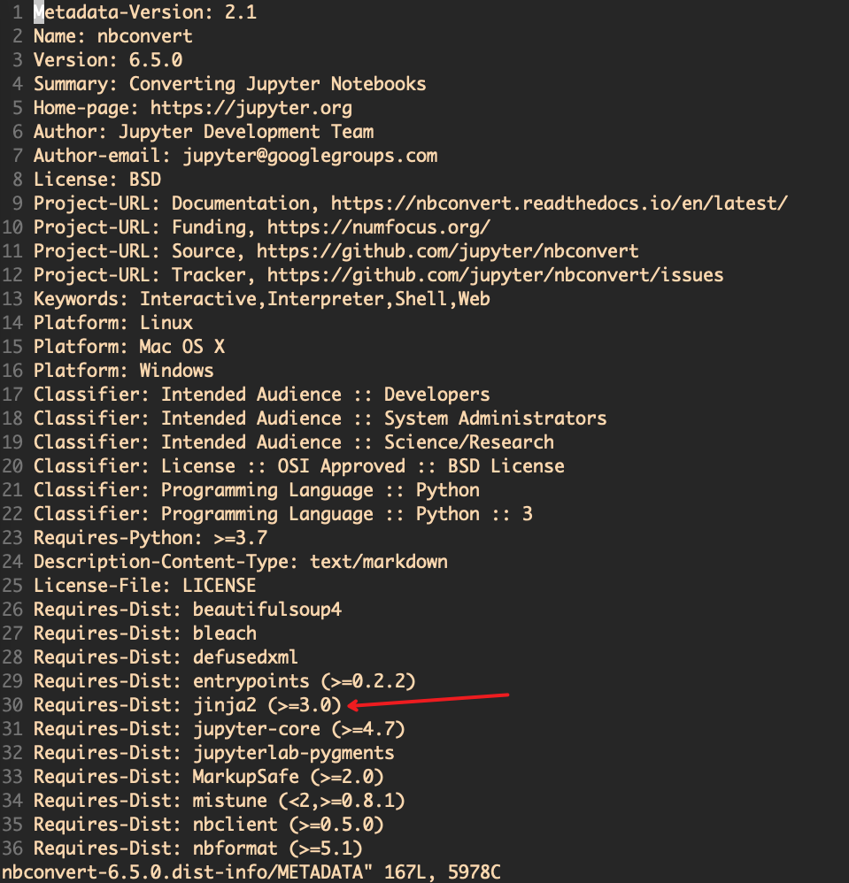

# 如何在pip install过程中锁定某个依赖包的版本？

原本机器上已有 jinja2==2.11.3

```bash
linyc:~$ pip show jinja2
Name: Jinja2
Version: 2.11.3
Summary: A very fast and expressive template engine.
Home-page: https://palletsprojects.com/p/jinja/
Author: Armin Ronacher
Author-email: armin.ronacher@active-4.com
License: BSD-3-Clause
Location: /home/linyc/.local/pip/lib/python3.7/site-packages
Requires: MarkupSafe
Required-by: 
```

后来工程报错，排查很久后才发现原来jinja2版本不知何时变成3.1.2了

发现元凶是这个安装：

```bash
pip install nbconvert==6.5.0
```

安装之后，jinja2版本会被改成
```bash
linyc:~$ pip show jinja2
Name: Jinja2
Version: 3.1.2
Summary: A very fast and expressive template engine.
Home-page: https://palletsprojects.com/p/jinja/
Author: Armin Ronacher
Author-email: armin.ronacher@active-4.com
License: BSD-3-Clause
Location: /home/linyc/.local/pip/lib/python3.7/site-packages
Requires: MarkupSafe
Required-by: nbconvert
```

整个安装过程中很隐蔽的就把版本改了！不去查安装日志根本不知道到底是啥时候升的，谁把它升上去的！

决定把nbconvert下载下来看看

```
pip download --no-deps nbconvert==6.5.0
unzip nbconvert-6.5.0-py3-none-any.whl
```

查看这个文件就可以知道nbconvert具体需求jinja2的版本

```
vim nbconvert-6.5.0.dist-info/METADATA
```

<div align="center"></div>

哦，是要大于等于3.0，所以它要升jinja2的版本。

那么如何才能不要让nb的安装影响到jinja2的版本？亦或者在更改版本的时候有个强提示甚至退出？

一种方案是

```bash
pip install --no-deps nbconvert==6.5.0
```

可是nb也有很多底层依赖包需要安装，它的依赖表里有entrypoints, bleach, nbformat, ... defusedxml, tinycss2这些

假设原来机器上本来就没有tinycss2，那么 --no-deps在跳过jinja的同时，也跳过了tinycss2的安装。nb依然可能没法用。

所以这里祭出来第二个方案：使用constrant.txt。文件内容很简单，如下：

```bash
linyc:~$ cat constraints.txt 
Jinja2==2.11.3
```

这个文件的语法和requirement.txt是完全一样的。

我们先把jinja2版本恢复回去，同时再次卸载nbconvert与tinycss2。然后执行如下命令

```bash
pip install nbconvert==6.5.0 -c constraints.txt
```

此时就会明确的报错退出了，提示jinja2版本冲突，不再进行nbconvert 与tinycss2的安装，并且jinja2也保持在了2.11.3 版本。

```
linyc:~$ pip install nbconvert==6.5.0 -c constraints.txt
Defaulting to user installation because normal site-packages is not writeable
Looking in indexes: https://pypi.tuna.tsinghua.edu.cn/simple
Collecting nbconvert==6.5.0
  Using cached https://pypi.tuna.tsinghua.edu.cn/packages/e8/f9/2de57146b8995d7f1b68d6fd0b4751d68c23f52e6f4ad926a7274184e8f2/nbconvert-6.5.0-py3-none-any.whl (561 kB)
ERROR: Cannot install nbconvert==6.5.0 because these package versions have conflicting dependencies.

The conflict is caused by:
    nbconvert 6.5.0 depends on jinja2>=3.0
    The user requested (constraint) jinja2==2.11.3

To fix this you could try to:
1. loosen the range of package versions you've specified
2. remove package versions to allow pip attempt to solve the dependency conflict

ERROR: ResolutionImpossible: for help visit https://pip.pypa.io/en/latest/user_guide/#fixing-conflicting-dependencies
```

虽然是报错，但是比起偷偷地改换底层依赖包版本的方案来说，实在好太多了。

要知道其他顶层包就是想要jinja包版本不超过3，结果你nb偷偷升上去了，其他包的运行的就莫名其妙报错了，这怎么能忍？

所以还是安装过程中明显地报错退出，然后让程序员提前介入去安排包的版本和安装顺序，提前暴露风险，比起猝不及防的生产环境突然报错要来的更好。
